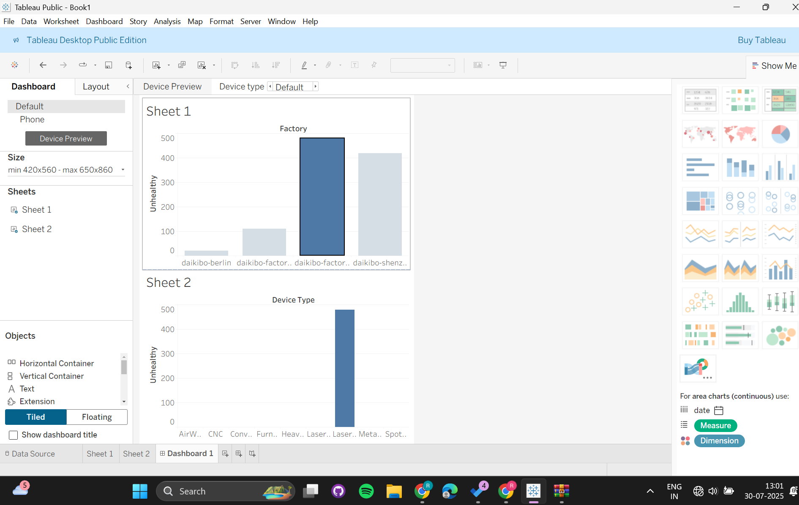

# 📊 Deloitte Data Analytics Virtual Experience Program (Forage)

This repository documents my participation in the **Deloitte Australia Data Analytics Job Simulation** hosted on [Forage](https://www.theforage.com/), completed in **July 2025**.

---

## 🧠 Overview

As part of this simulation, I took on the role of a Data Analyst at Deloitte, supporting a telecommunications client — **SmartBridge** — with insights to improve business decisions and customer retention.

This job simulation involved tasks such as:
- Cleaning and classifying large datasets
- Developing visual dashboards
- Communicating analytical insights to both clients and internal stakeholders

---

## ✅ Tasks Completed

### 🔹 Task 1: Data Visualization (Tableau)
- Created an interactive dashboard to visualize unhealthy device counts by:
  - 📌 **Factory location**
  - 📌 **Job **

📸 Dashboard Preview:  

### 🔹 Task 2: Data Cleaning (Excel)
- Used functions to handle missing data, remove inconsistencies, and reclassify device types.
- Output: Cleaned and transformed dataset used for downstream analysis.

📎 [Task File: Equality Table.xlsx](./Task%205%20Equality%20Table.xlsx)

---

## 💼 Skills Gained
- Data Modeling
- Spreadsheets
- Tableau
- Data Analysis

---

## 📜 Certificate

✔️ Awarded a Certificate of Completion by Deloitte Australia through the Forage platform.

---

> 📝 _This virtual internship gave me practical exposure to the types of tasks Deloitte data analysts perform in client-facing scenarios._

